# Entity Relationship Diagram

Phase 0 · The full target domain. **Implemented** models exist in
`apps/packages/database/prisma/schema.prisma` today; **planned** models are shown so teams working
in parallel can align on names and relationships before their phase begins.

Only Phase 1 models were migrated initially. Adding later tables later, one phase at a time, avoids
merge conflicts between ten developers editing one schema file. See
[ADR-0008](../adr/0008-phased-schema-migrations.md).

Legend: `[P1]` implemented in Phase 1 · `[P2]`… `[P8]` planned in that phase.

```mermaid
erDiagram
    %% ============ Identity, tenancy, access [P1] ============
    ORGANIZATION ||--o{ ORGANIZATION_MEMBERSHIP : "has members"
    ORGANIZATION ||--o{ AUDIT_LOG : "scopes"
    USER ||--o{ ORGANIZATION_MEMBERSHIP : "joins"
    USER ||--o{ REFRESH_TOKEN : "holds"
    USER ||--o{ AUDIT_LOG : "acts"
    ROLE ||--o{ ORGANIZATION_MEMBERSHIP : "granted by"
    ROLE ||--o{ ROLE_PERMISSION : "bundles"
    PERMISSION ||--o{ ROLE_PERMISSION : "included in"

    ORGANIZATION {
        uuid id PK
        string name
        string slug UK "lowercase, unique"
        char country_code "default KE"
        string timezone "Africa/Nairobi"
        char currency "KES"
        boolean is_active
        timestamptz created_at
        timestamptz updated_at
    }

    USER {
        uuid id PK
        string email UK "citext, lowercased"
        string password_hash "bcrypt, never returned"
        string first_name
        string last_name
        boolean is_active
        boolean is_platform_admin "emergency break-glass"
        int failed_login_count
        timestamptz locked_until
        timestamptz email_verified_at
        timestamptz last_login_at
        timestamptz password_changed_at
        timestamptz created_at
        timestamptz updated_at
    }

    ORGANIZATION_MEMBERSHIP {
        uuid id PK
        uuid user_id FK
        uuid organization_id FK
        uuid role_id FK
        membership_status status "ACTIVE, SUSPENDED"
        timestamptz created_at
        timestamptz updated_at
    }

    ROLE {
        uuid id PK
        string key UK "SUPER_ADMIN, ORG_ADMIN, ..."
        string name
        text description
        boolean is_system "seeded, not deletable"
        boolean bypasses_permissions "SUPER_ADMIN only"
        timestamptz created_at
        timestamptz updated_at
    }

    PERMISSION {
        uuid id PK
        string key UK "payroll_run:finalize"
        string resource
        string action
        text description
        boolean is_sensitive "audit + step-up candidate"
        boolean is_self_scoped "restricted to own records"
        timestamptz created_at
    }

    ROLE_PERMISSION {
        uuid role_id PK,FK
        uuid permission_id PK,FK
    }

    REFRESH_TOKEN {
        uuid id PK
        uuid user_id FK
        string token_hash UK "sha256, never the raw token"
        uuid family_id "rotation lineage, reuse detection"
        timestamptz expires_at
        timestamptz revoked_at "nullable"
        string revoked_reason "nullable"
        string ip_address "nullable"
        string user_agent "nullable"
        timestamptz created_at
    }

    AUDIT_LOG {
        uuid id PK
        uuid organization_id FK "nullable for platform events"
        uuid actor_user_id FK "nullable for system actions"
        string actor_role "role at time of action"
        string action "employee.updated"
        string resource_type
        string resource_id "nullable"
        audit_outcome outcome "SUCCESS, DENIED, FAILURE"
        string ip_address "nullable"
        string user_agent "nullable"
        string request_id "correlates logs to the entry"
        jsonb before "nullable, redacted"
        jsonb after "nullable, redacted"
        jsonb metadata "nullable"
        timestamptz created_at
    }

    %% ============ Organization master data [P2] ============
    ORGANIZATION ||--o{ DEPARTMENT : contains
    DEPARTMENT ||--o{ EMPLOYEE : groups
    ORGANIZATION ||--o{ EMPLOYEE : employs

    DEPARTMENT {
        uuid id PK
        uuid organization_id FK
        string code UK "unique per organization"
        string name
        uuid parent_department_id FK "nullable, self reference"
        boolean is_active
        timestamptz created_at
        timestamptz updated_at
    }

    EMPLOYEE {
        uuid id PK
        uuid organization_id FK
        uuid department_id FK
        uuid user_id FK "nullable, links to a login"
        string employee_number UK "unique per organization"
        string first_name
        string last_name
        string national_id "nullable, encrypted at rest"
        string tax_number "KRA PIN, nullable"
        string nssf_number "nullable"
        date date_of_birth
        char gender "nullable"
        date employment_start_date
        string work_email
        string phone_number "nullable"
        string job_title
        employment_status status "ACTIVE, ON_LEAVE, SUSPENDED, TERMINATED"
        timestamptz created_at
        timestamptz updated_at
    }

    %% ============ Employment and compensation [P3] ============
    EMPLOYEE ||--o{ EMPLOYMENT_CONTRACT : "governed by"
    EMPLOYEE ||--o{ COMPENSATION_RECORD : compensated_by

    EMPLOYMENT_CONTRACT {
        uuid id PK
        uuid employee_id FK
        uuid organization_id FK
        string contract_type "PERMANENT, CONTRACT, PROBATION, INTERN"
        date effective_from
        date effective_to "nullable, null means open ended"
        uuid created_by_user_id FK
        text terms "nullable"
        boolean is_active
        timestamptz created_at
        timestamptz updated_at
    }

    COMPENSATION_RECORD {
        uuid id PK
        uuid employee_id FK
        uuid organization_id FK
        decimal amount "Decimal(19,4), never a float"
        char currency "KES"
        pay_frequency frequency "MONTHLY, BIWEEKLY, WEEKLY"
        date effective_from
        date effective_to "nullable, null means current"
        string currency_reason "nullable, effective dating reason"
        uuid created_by_user_id FK
        timestamptz created_at
        timestamptz updated_at
    }

    COMPONENT {
        uuid id PK
        uuid organization_id FK
        string code "BASIC, HOUSE_ALLOWANCE, NSSF, ..."
        string name
        component_type type "EARNING, DEDUCTION, EMPLOYER_CONTRIBUTION"
        boolean is_taxable
        boolean is_statutory
        boolean is_system "seeded, not deletable"
        boolean is_active
    }

    EMPLOYEE_COMPONENT {
        uuid id PK
        uuid employee_id FK
        uuid component_id FK
        decimal amount "Decimal(19,4)"
        decimal percentage "nullable, alternative to amount"
        date effective_from
        date effective_to "nullable"
        uuid created_by_user_id FK
        timestamptz created_at
        timestamptz updated_at
    }

    %% ============ Statutory rules [P5] ============
    ORGANIZATION ||--o{ STATUTORY_RULE_VERSION : versions

    STATUTORY_RULE_VERSION {
        uuid id PK
        uuid organization_id FK
        string rule_type "PAYE, NSSF, SHIF, HOUSING_LEVY"
        int version
        date effective_from
        date effective_to "nullable, null means current"
        jsonb brackets "rate table with explicit precision"
        string source_url "official KRA, NSSF or SHA"
        string source_reference
        timestamptz verified_on "date the source was last read"
        text notes "nullable"
        timestamptz created_at
    }

    %% ============ Payroll periods and runs [P6] ============
    ORGANIZATION ||--o{ PAYROLL_PERIOD : defines
    ORGANIZATION ||--o{ PAYROLL_RUN : executes
    PAYROLL_PERIOD ||--o{ PAYROLL_RUN : covers
    PAYROLL_RUN ||--o{ PAYROLL_LINE : produces
    PAYROLL_RUN ||--o{ APPROVAL_RECORD : approved_by
    PAYROLL_RUN ||--o{ PAYSLIP : issues
    EMPLOYEE ||--o{ PAYROLL_INPUT : supplies

    PAYROLL_PERIOD {
        uuid id PK
        uuid organization_id FK
        string code "2026-10-MONTHLY"
        date period_start
        date period_end
        date pay_date
        pay_frequency frequency
        boolean is_locked
        timestamptz created_at
    }

    PAYROLL_RUN {
        uuid id PK
        uuid organization_id FK
        uuid payroll_period_id FK
        payroll_run_state state "DRAFT..PAID, CANCELLED, REVERSED"
        uuid prepared_by_user_id FK
        uuid approved_by_user_id FK "nullable, must differ from preparer"
        timestamptz submitted_at
        timestamptz approved_at
        timestamptz finalized_at
        uuid statutory_rule_version_id FK "reproducibility"
        int calculation_attempts
        timestamptz created_at
        timestamptz updated_at
    }

    PAYROLL_LINE {
        uuid id PK
        uuid payroll_run_id FK
        uuid employee_id FK
        decimal gross_pay "Decimal(19,4)"
        decimal total_deductions
        decimal net_pay
        uuid rule_version_id FK "which rules produced this"
        timestamptz created_at
    }

    APPROVAL_RECORD {
        uuid id PK
        uuid payroll_run_id FK
        uuid actor_user_id FK
        string action "SUBMITTED, APPROVED, REJECTED, FINALIZED, REVERSED"
        text reason "mandatory for rejection and reversal"
        string ip_address "nullable"
        timestamptz created_at
    }

    %% ============ Payroll inputs [P4] ============
    PAYROLL_INPUT {
        uuid id PK
        uuid employee_id FK
        uuid payroll_period_id FK
        uuid organization_id FK
        input_type input_type "ATTENDANCE, OVERTIME, BONUS, COMMISSION, ADJUSTMENT"
        decimal quantity "hours, days or units"
        decimal rate "nullable, unit rate when applicable"
        decimal amount "nullable, computed when applicable"
        boolean is_taxable
        string note "nullable"
        uuid created_by_user_id FK
        timestamptz created_at
        timestamptz updated_at
    }

    %% ============ Payslips and reports [P7] ============
    PAYROLL_LINE ||--o| PAYSLIP : renders

    PAYSLIP {
        uuid id PK
        uuid payroll_line_id FK
        uuid organization_id FK
        uuid employee_id FK
        string storage_path "GCP Cloud Storage object path"
        string storage_generation "guards against overwrite"
        string content_sha256 "integrity check"
        int size_bytes
        email_delivery_status email_status "PENDING, SENT, FAILED"
        timestamptz emailed_at
        timestamptz created_at
    }

    REPORT {
        uuid id PK
        uuid organization_id FK
        uuid payroll_run_id FK "finalized runs only"
        report_type type "PAYROLL_REGISTER, PAYE, NSSF, SHIF, P9"
        date period_start
        date period_end
        string storage_path "nullable"
        jsonb parameters "filters applied at generation"
        timestamptz generated_at
    }

    %% ============ Job execution [P8] ============
    JOB_EXECUTION {
        uuid id PK
        string queue
        string job_type "payslip.generate, email.send"
        string idempotency_key UK "retry safe"
        job_status status "QUEUED, ACTIVE, DONE, RETRYING, FAILED"
        int attempts
        text last_error "nullable"
        timestamptz created_at
        timestamptz updated_at
    }
```

## Cardinality and invariant notes

1. **Every tenant-owned table carries `organizationId`.** Not all of them need the relation in the
   diagram, but all of them must have the column, because the service layer scopes by it.
2. **`ORGANIZATION_MEMBERSHIP` is unique on `(user_id, organization_id)`.** One role per user per
   organization.
3. **`EMPLOYEE.user_id` is nullable and unique.** Not every employee has a login. At most one
   employee record per user account.
4. **`EMPLOYMENT_CONTRACT` overlap is prevented by a PostgreSQL exclusion constraint** on
   `[employee_id]` over the `daterange(effective_from, effective_to)`, so an employee can never hold
   two overlapping active contracts. Application-level checks alone are not sufficient.
5. **`COMPENSATION_RECORD` and `EMPLOYEE_COMPONENT` are append-only and effective-dated.** A change
   closes the previous row with an `effective_to` and inserts a new one. History is never updated
   or deleted. The same exclusion-constraint technique prevents overlapping ranges.
6. **`PAYROLL_LINE` stores `rule_version_id`.** This is what makes a past run reproducible: given the
   inputs, the compensation snapshot and the rule version, the same engine yields the same output.
7. **`AUDIT_LOG` has no `updated_at`.** It is append-only. No application code updates or deletes it,
   and the database role used by the application is granted `INSERT` and `SELECT` only.
8. **`REFRESH_TOKEN` stores `token_hash`, never the token.** `family_id` groups a rotation lineage
   so replay detection can revoke all descendants.
9. **`PAYSLIP.storage_generation`** pins the object version, so a retried upload cannot silently
   replace an already-issued payslip.
10. **`JOB_EXECUTION.idempotency_key` is unique**, which is what makes every queued job retry-safe.

## Money columns

All monetary columns are `Decimal(19,4)` in PostgreSQL, surfaced as `Prisma.Decimal`, and manipulated
only through the money value object in `apps/packages/validation`. Floating-point types are
forbidden. Rounding is applied once, explicitly, at the points defined by the rule version. See
[ADR-0006](../adr/0006-money-precision-and-rounding.md).