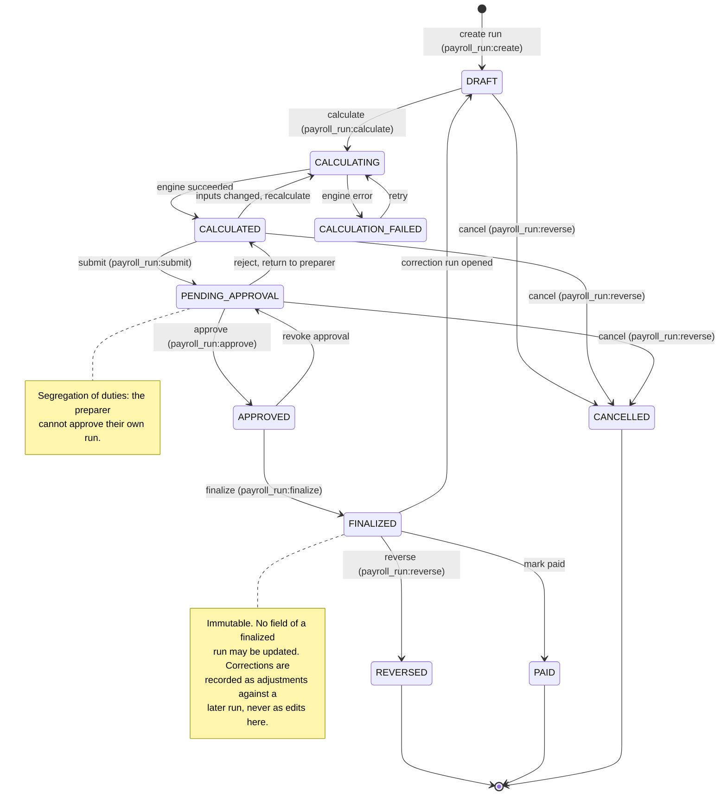
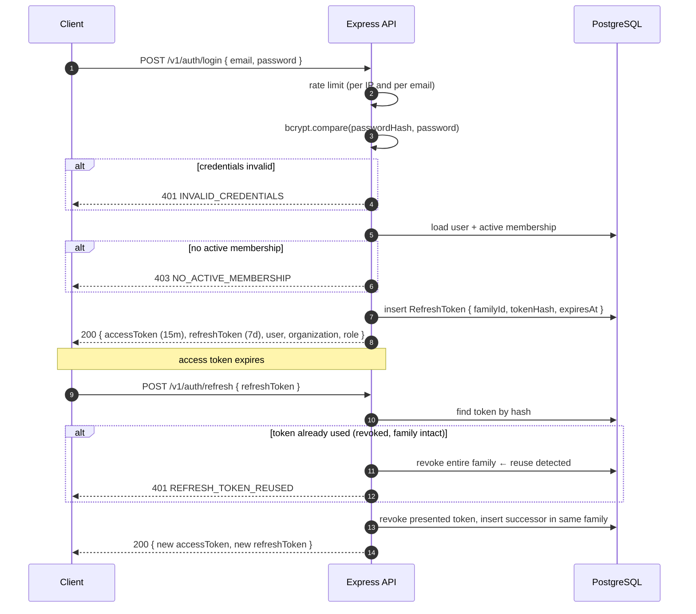
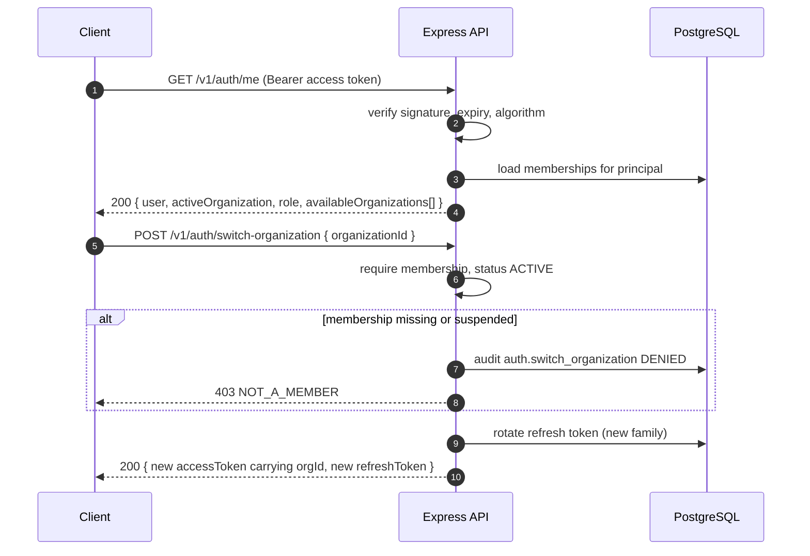
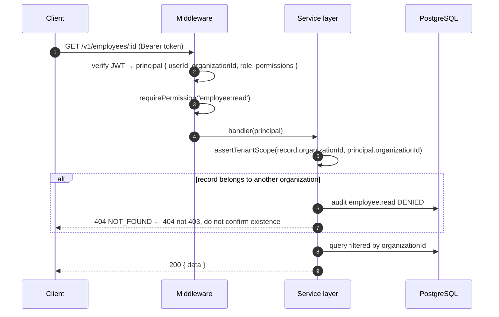
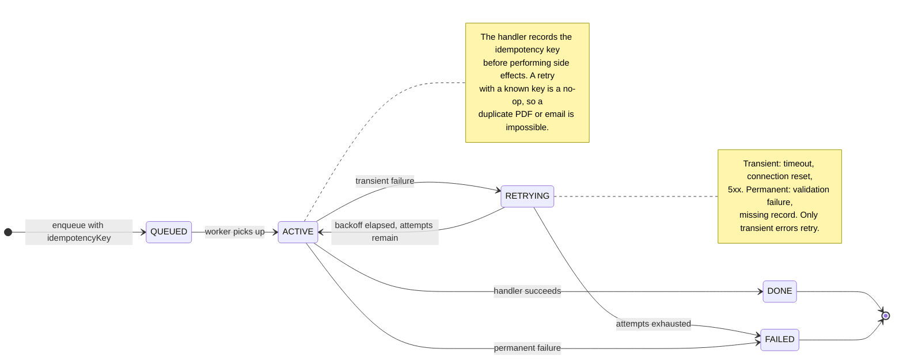

# Workflows and State Diagrams

Phase 0 · Authoritative for state transitions. Any code that changes a payroll run's state must
match the diagram below and update it in the same PR.

## 1. Payroll run lifecycle

### Transition rules

| From | To | Guard | Audit event |
| --- | --- | --- | --- |
| — | `DRAFT` | Caller has `payroll_run:create` | `payroll_run.created` |
| `DRAFT` | `CALCULATING` | `payroll_run:calculate`; period not already finalized | `payroll_run.calculation_started` |
| `CALCULATING` | `CALCULATED` | Engine returned a complete, itemised result | `payroll_run.calculated` |
| `CALCULATING` | `CALCULATION_FAILED` | Engine threw; error recorded, run unchanged | `payroll_run.calculation_failed` |
| `CALCULATION_FAILED` | `CALCULATING` | Retry permitted, attempt counter incremented | `payroll_run.calculation_retried` |
| `CALCULATED` | `CALCULATING` | At least one input changed since last calculation | `payroll_run.recalculated` |
| `CALCULATED` | `PENDING_APPROVAL` | `payroll_run:submit`; no validation exceptions | `payroll_run.submitted` |
| `PENDING_APPROVAL` | `APPROVED` | `payroll_run:approve`; **approver ≠ preparer** | `payroll_run.approved` |
| `PENDING_APPROVAL` | `CALCULATED` | `payroll_run:approve` with a rejection reason | `payroll_run.rejected` |
| `APPROVED` | `FINALIZED` | `payroll_run:finalize`; snapshot written in one transaction | `payroll_run.finalized` |
| `APPROVED` | `PENDING_APPROVAL` | `payroll_run:finalize` revoked, with reason | `payroll_run.approval_revoked` |
| `FINALIZED` | `PAID` | `payroll_run:finalize`; settlement recorded | `payroll_run.paid` |
| `FINALIZED` | `REVERSED` | `payroll_run:reverse`; reason mandatory | `payroll_run.reversed` |
| any non-terminal | `CANCELLED` | `payroll_run:reverse`; reason mandatory | `payroll_run.cancelled` |

Terminal states are `PAID`, `REVERSED` and `CANCELLED`. A run in a terminal state has no outgoing
transition except opening a correction run.

## 2. Authentication and token rotation

Rules encoded above:

- Access tokens are short-lived (15m) and stateless. Refresh tokens are long-lived (7d), stored
  **hashed**, and rotate on every use.
- Replay of a rotated refresh token revokes its whole family and is audit-logged as
  `auth.refresh_reuse_detected`. This is how token theft is caught.
- A 401 on refresh never reveals whether the email exists.

## 3. Organization switching

A user may hold memberships in several organizations. The active organization is a token claim, not
a request parameter, so it cannot be spoofed per request.

## 4. Tenant isolation on a data request

Two deliberate choices:

- **Authorization is applied in the service layer, not only in middleware.** Middleware cannot see
  which rows a query will touch, so middleware alone is not tenant isolation.
- **A cross-tenant read returns `404`, not `403`.** Returning `403` confirms the record exists,
  which is an enumeration leak.

## 5. Queued job execution

## 6. Phase 2+ workflows

Department, employee, contract and compensation workflows are specified in their own phase. When
they are written, they follow the same shape: a state diagram in this file, transition rules as a
table, guards naming the required permission, and an audit event per transition.